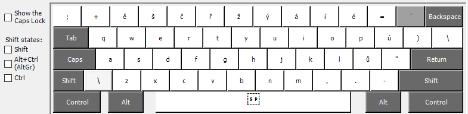
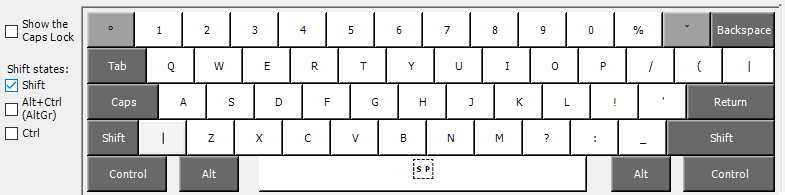
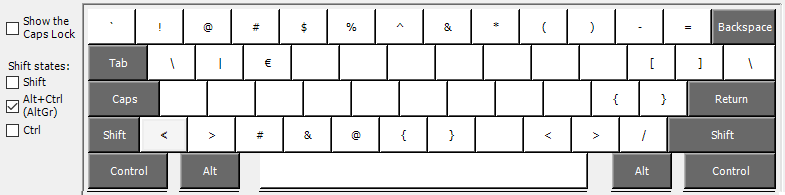

# České programátorské rozložení klávesnice pro Windows

Dlouhou dobu jsem používal dvě rozložení klávesnice a věřte mi, přehazování je vážně neefektivní. 
Bohužel žádná z českých klávesnic nenabízí plnohodnotné nebo přívětivé rozložení pro programování.
Vytvořil jsem tedy s své rozložení, které používám již delší dobu a mohu pouze doporučit.
Rozložení se jmenuje `Czech Programming (qwerty)` se zkratkou `cz-fila`.

## Instalace

Stáhněte instalační soubory z [poslední vydané verze](https://github.com/ingSlonik/queeg/tags).
Nainstalujte a někdy je potřeba restart.
V nastavení jazyku vyberte angličtinu a v ní `Czech Programming (qwerty)`.

Pokud potřebujete udělat jakékoli změny, stáhněte `keyboard-layout.klc` soubor a hurá do toho.

## Rozložení

### Shifh

### AltGr

